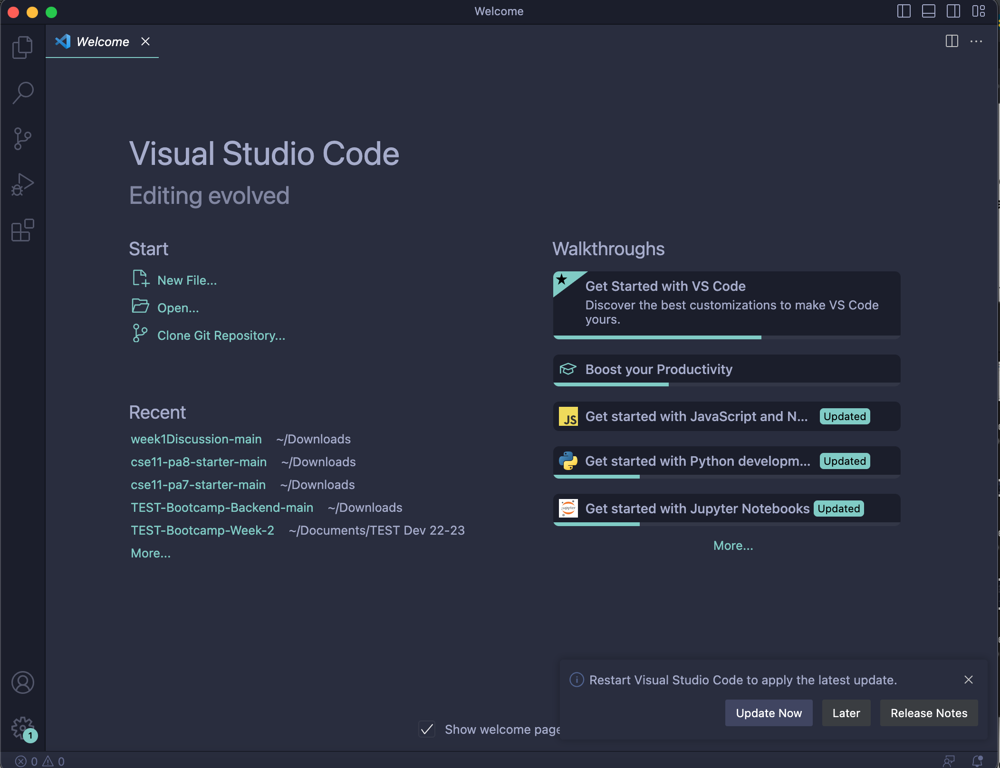
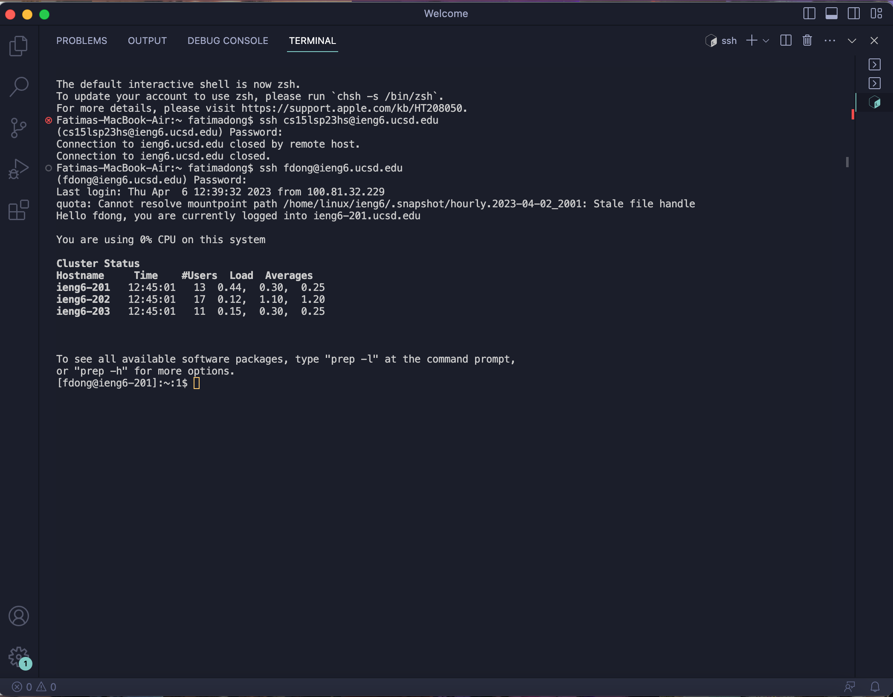
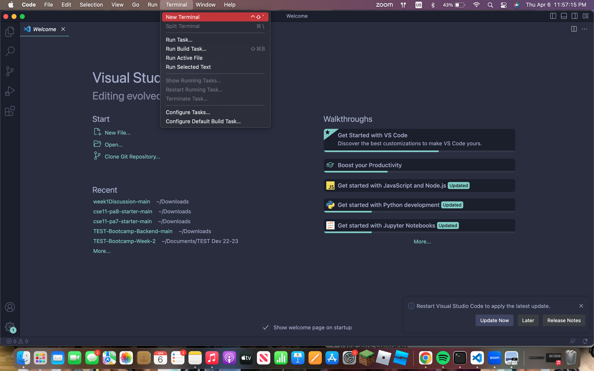
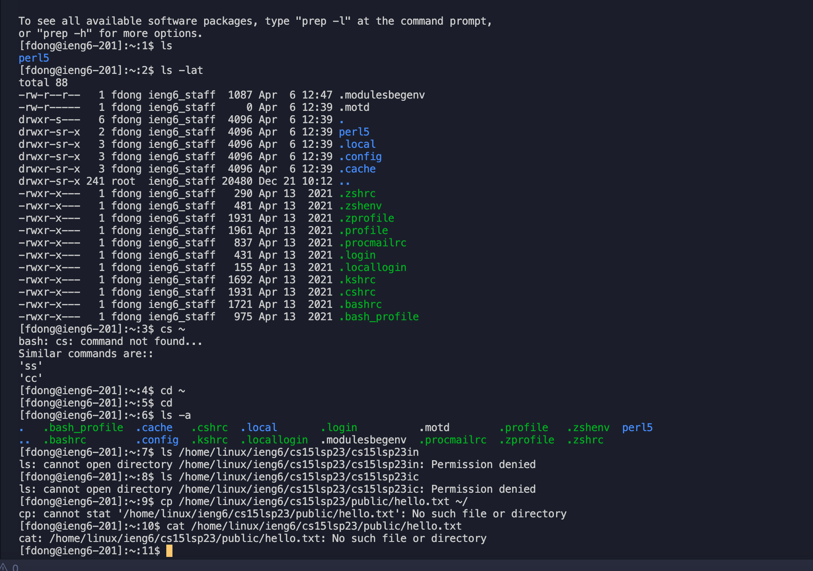

# Lab Report 1 

This is my lab report 1 - *remote access and filesystem.* 

## Part 1: Installing VScode



This is what I see after installing VSCode. In order to download VSCode, I clicked on this [link](https://code.visualstudio.com/). After clicking the download button for Mac devices, I had to install packages.

Thus, upon the **successful completion** of downloading VSCode on my macbook, I see this page when I open VSCode.

--- 

## Part 2: Remotely Connecting

> In this section, I ran into errors, in which I will explain later in this section.



In attempt to connect to the server, I followed the steps to establishing a connection using my personal ucsd username ieng6 account, instead of my cs15l one. 

### STEPS:
1. As soon as VSCode loads successfully (just like part 1), toggle on your sidebar on your macOS device. Hover over *"Terminal"* from one of the options, and click on *"New Terminal"*.
    
   > Your sidebar is found AT THE TOP of your desktop. 
   > 

2. After creating the new terminal, type this code block in your terminal. 
    **REMEMBER** do NOT include the $ or % sign.
   
   `$ ssh cs15lsp23__@ieng6.ucsd.edu`
   
   > replace the underscore with the last two letters, SPECIFIC to your account!

    You should receive this message from the terminal if this is the first time attempting: 
```
⤇ ssh cs15lsp23__@ieng6.ucsd.edu
The authenticity of host 'ieng6.ucsd.edu (128.54.70.227)' can't be established.
RSA key fingerprint is SHA256:ksruYwhnYH+sySHnHAtLUHngrPEyZTDl/1x99wUQcec.
Are you sure you want to continue connecting (yes/no/[fingerprint])? 
```
   
   In this case, type the command *yes*.
   
   It will ask for your password to your cs15l account! Don't worry about not seeing any characters pop up. The characters you type for your password will be invisible.
   
   You have successfully connected to the server if you see this message from the terminal:
   
```
Hello cs15lsp23__, you are currently logged into ieng6-203.ucsd.edu

You are using 0% CPU on this system

Cluster Status 
  Hostname     Time    #Users  Load  Averages  
  ieng6-201   23:25:01   0  0.08,  0.17,  0.11
  ieng6-202   23:25:01   1  0.09,  0.15,  0.11
  ieng6-203   23:25:01   1  0.08,  0.15,  0.11
    
 ``` 
 
  **PROCEED TO STEP 3 if you see error**
  
  Otherwise, you are done with *Part 2*!
  
3. If you are experiencing any errors like I did, I recommend doing the following in order: 
    * double check if you typed in your password correctly!
    
    If that doesn't work, 
    * you should use your UCSD username@ieng6.ucsd.edu account. 
    > You already have the password set (the regular one to access email and tritonlink)
    
    It will work just the same, and you should be able to receive the same messages from the second step.


In my case, I had to use my ucsd ieng6 account because the remote server closed the connection on its own when I was attempting to login on my cs15l account. Thankfully, I had help from a TA, and at the end of section, I had to put down my information to request IT in order to fix my situation. I was told that it was an ADs problem, so IT will help.
    
   Hooray! You may go to part 3 and begin.

---

## Part 3: Trying Some Commands




 
  
