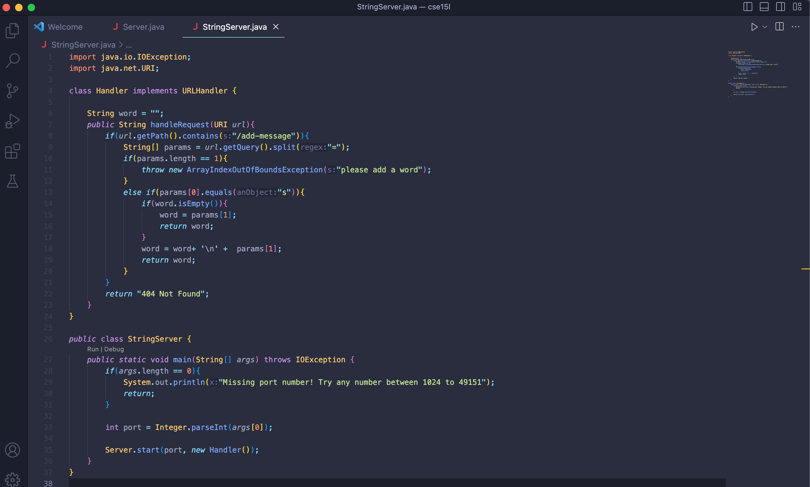
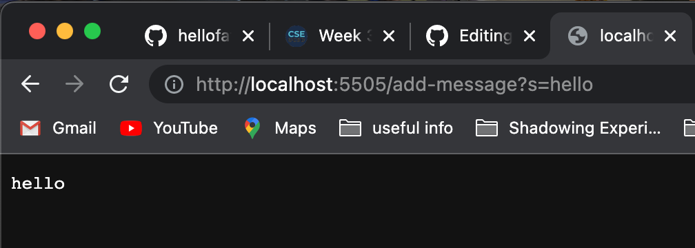

# Lab Report 2

## Part 1

 

This is my code for StringServer! The purpose of this file is to display strings that the user inputs into the URL onto new lines of the page.

1. Screenshot 1, using `/add-message`

> 

* In order to print out the words, the method I used was `handleRequest` from the class `Handler`. As for connecting to the server, I used the main method from StringServer class. 

* The relevant argument for `handleRequest` is the url, a URI object:

`http://localhost:5505/add-message?s=hello`

* The value for the String s argument is `hello` 
* In this particular screenshot, the value for String s only changed to an existing one. For my code in the `Handler` class, I created a global variable named `word` as an empty String, which will be used to reference the value of String s.

2. Screenshot 2, using `/add-message` 

>   

* In order to print out the words, the method I used was `handleRequest` from the class `Handler`. As for connecting to the server, I used the main method from StringServer class. This will have the same answer as the screenshot above

* The relevant argument for `handleRequest` is the url, a URI object:

`http://localhost:5505/add-message?s=what is your name?`

* The value for the String s argument is `what is your name?` 

* In this particular screenshot, the value for String s only changed to `what is your name?` and the URI object changed the query. For my code in the `Handler` class, I created a global variable named `word` as an empty String, which will be used to reference the value of String s. The word variable concatenates the new value of String s with a new line. Thus, that is why the page saved the previous String values!

### Onto part 2!

---

## Part 2
In lab 3, I will choose a bug from the file, ArrayExamples.java.

The snippet of code that contains the bug is: 
```
 static void reverseInPlace(int[] arr) {
    for(int i = 0; i < arr.length; i += 1) {
      arr[i] = arr[arr.length - i - 1];
    }
  }
  
 ```
An example of failure-inducing input would be:
> `int[] nonemptyArray = {10, 9, 8}`

An example of an input that would not induce a failure would be:
> `int [] emptyArray = [];`

The symptoms based on the two provided inputs above:
> 
Before code:
```
  static void reverseInPlace(int[] arr) {
    for(int i = 0; i < arr.length; i += 1) {
      arr[i] = arr[arr.length - i - 1];
    }
  }
```

After code:
```
  static void reverseInPlace(int[] arr) {
    for(int i = 0; i < arr.length/2; i += 1) {
      int temp = arr[i];
      arr[i] = arr[arr.length - i - 1];
      arr[arr.length-i-1] = temp;
    }
  }
```

### Onto part 3!
---
     
## Part 3

Something that I learned from weeks 2 was running a remote server through a method we were given. I've always thought that starting a server required a lot more code, and a port is something specific to your device. During lab, we were taught on how to access other's server, which I find pretty cool.

--- 

Thanks for following the process with me!

