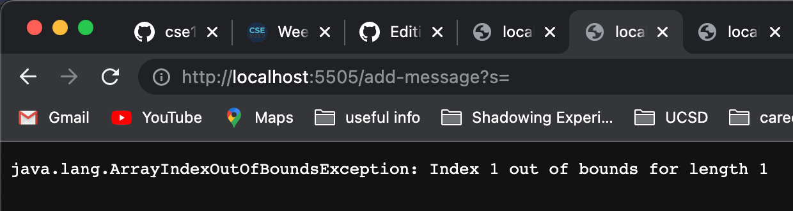

# Lab Report 2

## Part 1

 

This is my code for StringServer! The purpose of this file is to display strings that the user inputs into the URL onto new lines of the page.

1. Screenshot 1, using `/add-message`

> 

* In order to print out the words, the method I used was handleRequest from the class Handler. As for connecting to the server, I used the main method from StringServer class. 

* The relevant argument for handleRequest is the url, a URI object:

`http://localhost:5505/add-message?s=hello`

* The value for the String s argument is `hello` 
* In this particular screenshot, the value for String s only changed to an existing one. For my code in the Handler class, I created a global variable named `word` as an empty String, which will be used to reference the value of String s.

2. Screenshot 2, using `/add-message` 

>   

* In order to print out the words, the method I used was handleRequest from the class Handler. As for connecting to the server, I used the main method from StringServer class. This will have the same answer as the screenshot above

* The relevant argument for handleRequest is the url, a URI object:

`http://localhost:5505/add-message?s=what is your name?`

* The value for the String s argument is `what is your name?` 

* In this particular screenshot, the value for String s only changed to `what is your name?` and the URI object changed the query. For my code in the Handler class, I created a global variable named `word` as an empty String, which will be used to reference the value of String s. The word variable concatenates the new value of String s with a new line. Thus, that is why the page saved the previous String values!

### Onto part 2!

## Part 2

For the failure-inducing input of this code:
```
http://localhost:5505/add-message?s=
```

The reason why this is a failure-inducing input is that the user may not input any strings for the URI object. In the handlerRequest method, there is a split string method where it creates an array of String. The URI object would be split based on the '=', so everything after '=' is considered index 1 of the array and length 2.

However, if the user does not input anything for String s value, then the array would be a length of 1 and `array[1]` would not exist. 

I wanted to check for possible failure-inducing input, so I tried to create a URI object without a String s value. Upon attempting, I had this on my webpage:
> 

In order to fix this problem, I did 
```
if(params.length == 1){
                throw new ArrayIndexOutOfBoundsException("please add a word");
}
```

Throwing an exception with String message would not include it in the webpage! By throwing an exception, it would allow the code to catch it and keep it running for the user! `params` is the name of the array that was created from the string split method. If the length of the params array is 1, then the user did not input anything for the String s value. 

### Onto part 3!

     


