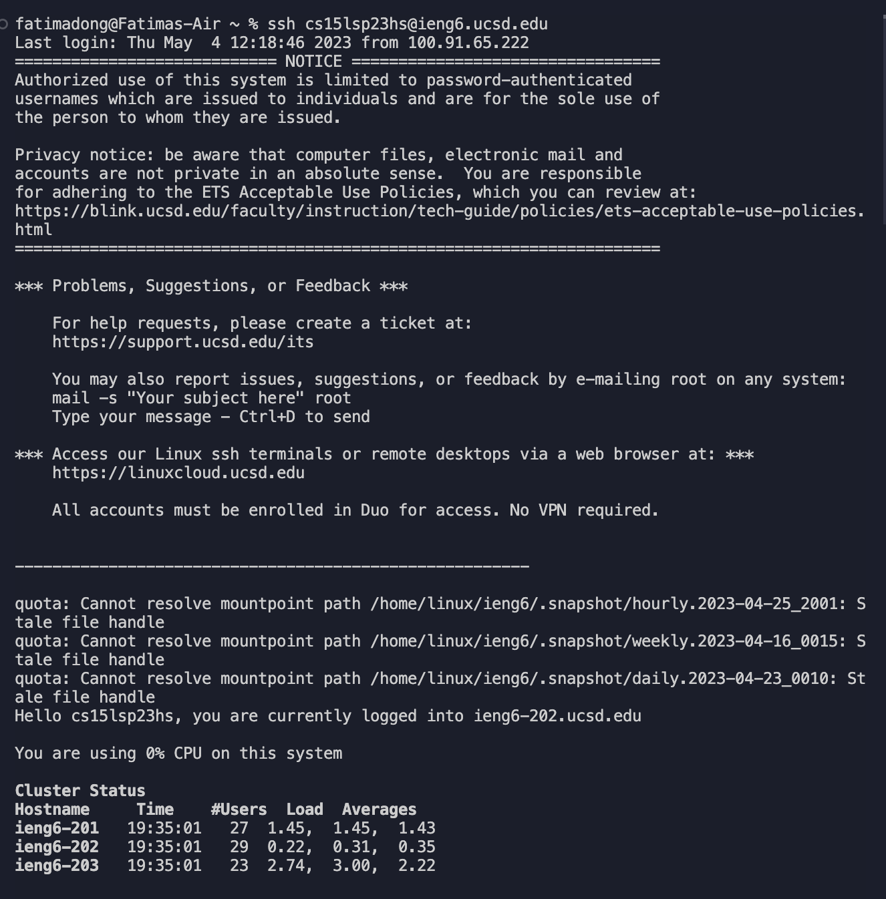
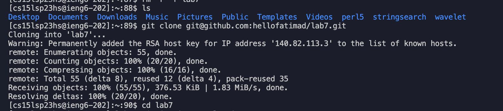
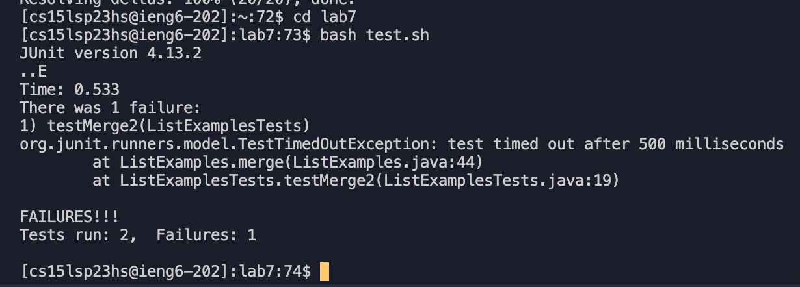
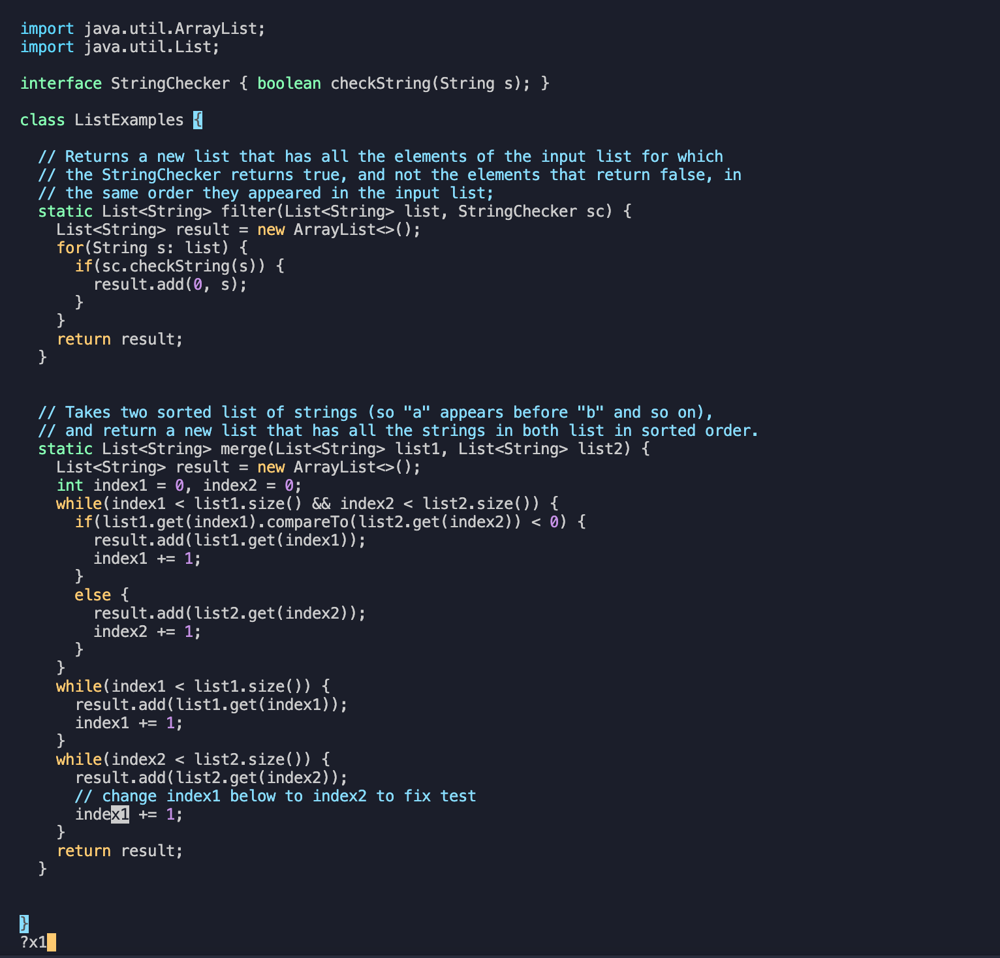
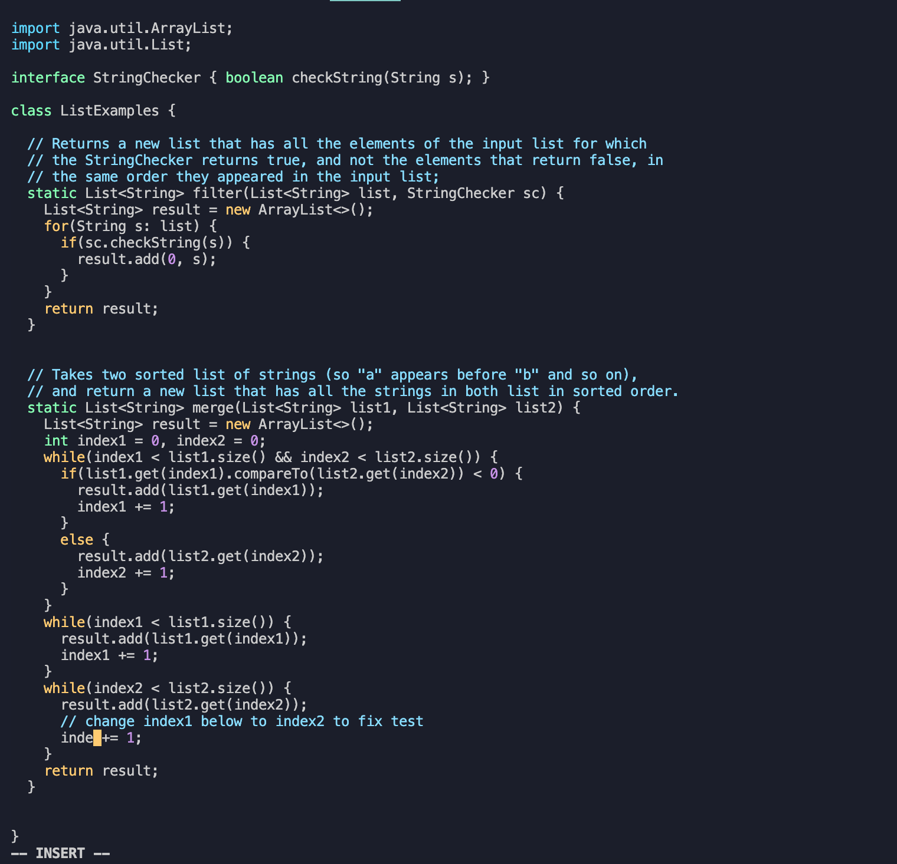
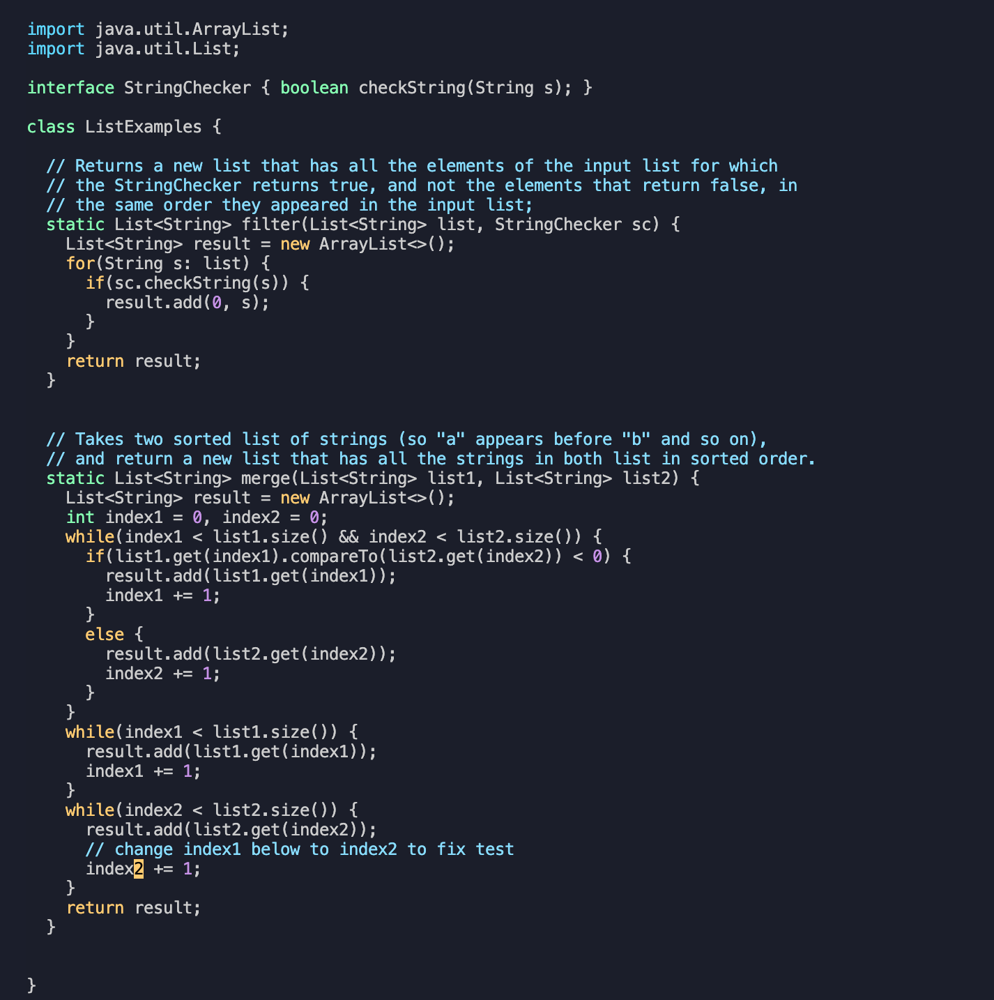
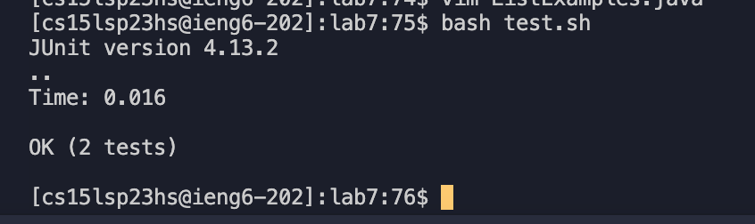
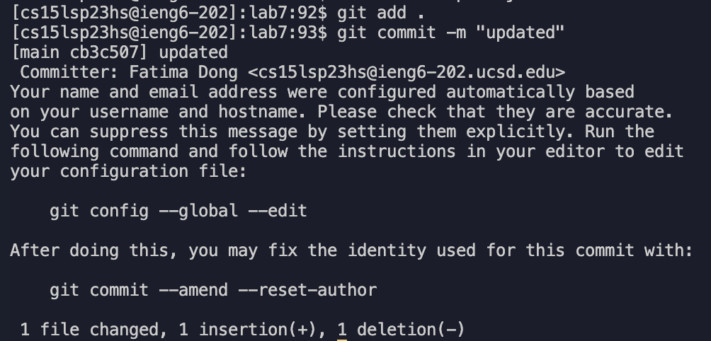
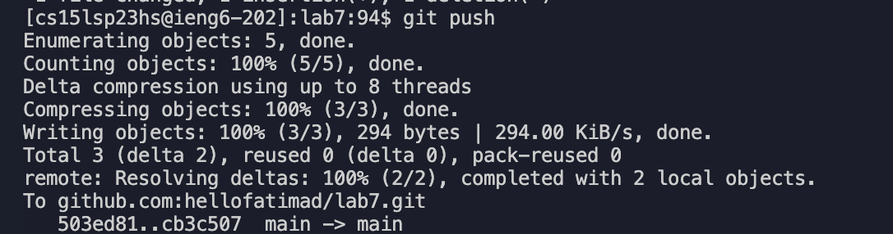
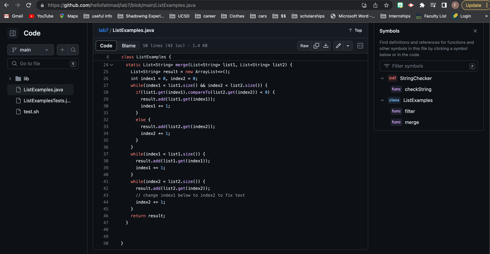

# Lab Report 4

1. Login to ieng6 account

> 

For the first step, we have to login in the ieng6 account.

2. Clone repository from the github account

> 

For the second step, I used `ls` command because I want to check if lab7 repository doesn't exist in my ieng6 account. Once confirmed that
it does not exist, I used `git clone git@github.com:hellofatimad/lab7.git` 

Then, I am ready to start on making changes.

3. Run tests to demonstrate they fail

> 

This shows that I did not make any changes to the fail prior to cloning the repository. Then, I `cd lab7` into the terminal to 
ensure that I am in the lab7 directory.

4. Edit the file code to fix the bug
> 

> 

> 

Before making any changes in the file, I made the command, `vim ListExamples.java`

The list of of keys that I used were: `<?x1> <esc> <ce> <x2> <esc> <:wq>`

The `<?x1>` vim command shows any keywords with the pattern ___x1. Therefore, searching for the suffix x1 in the file reverse (bottom up). 

`<esc>` commands in general takes the user to normal mode.

`<ce>` is for deleting the highlighted characters.

`<x2>` is for making the complete change to `index2` .

`<:wq>` is for saving all the changes and exiting the file.

5. Show the test succeeded
> 

This is to demonstrate how I successfully changed the file and the test is confirmed to pass.
To run any tests, I must `bash test.sh` in the terminal.

6. commit and push the changed files to Github

>  

> 

These are the commands I used to add, commit, and push any changes from the command line. 

> 

This is evidence that my changes did get pushed to my Github account!

Thanks for following the process with me! :)
