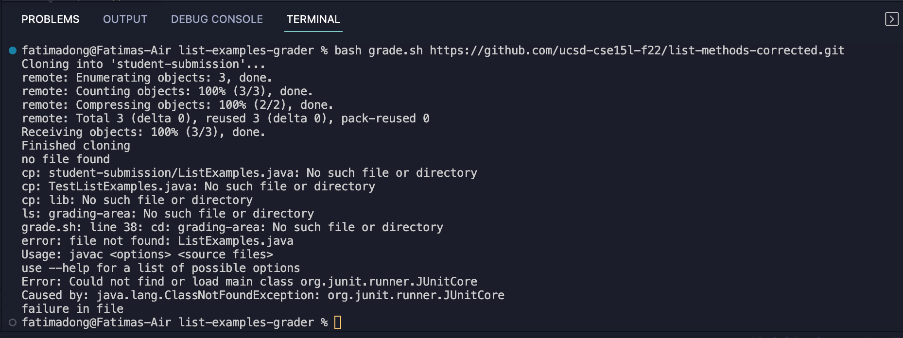
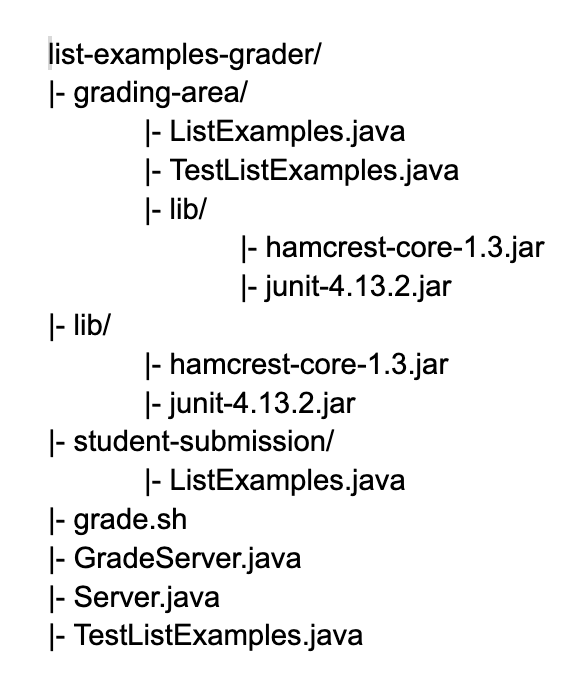
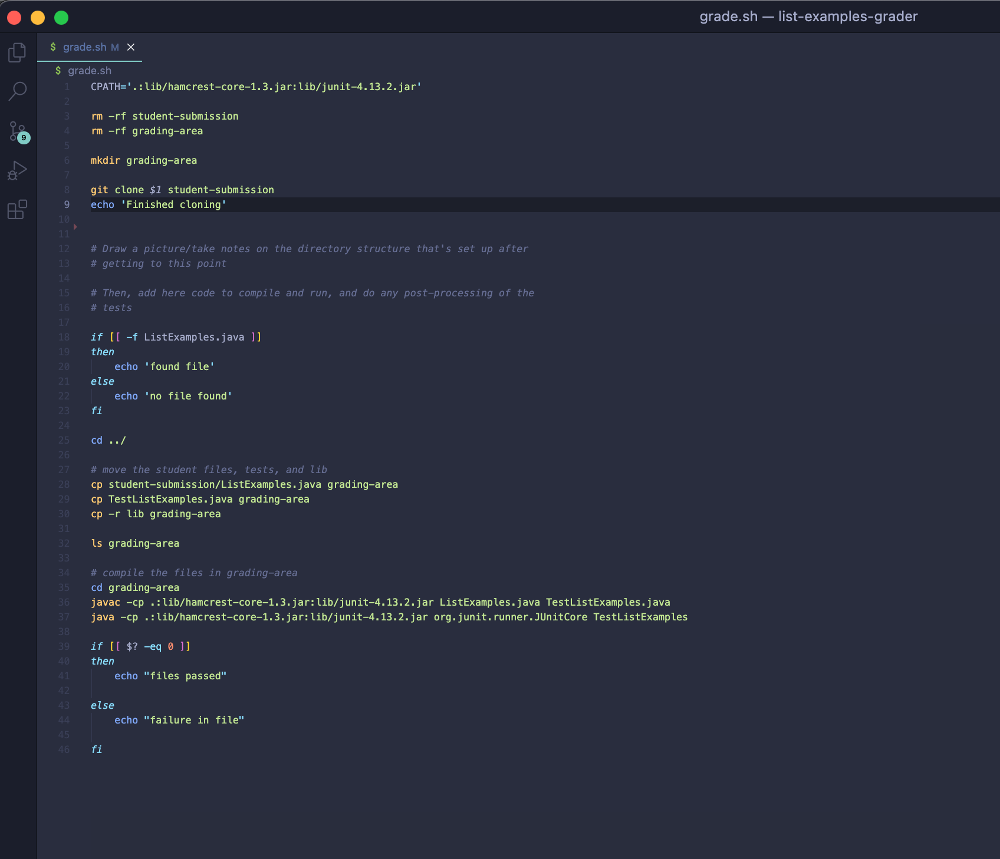
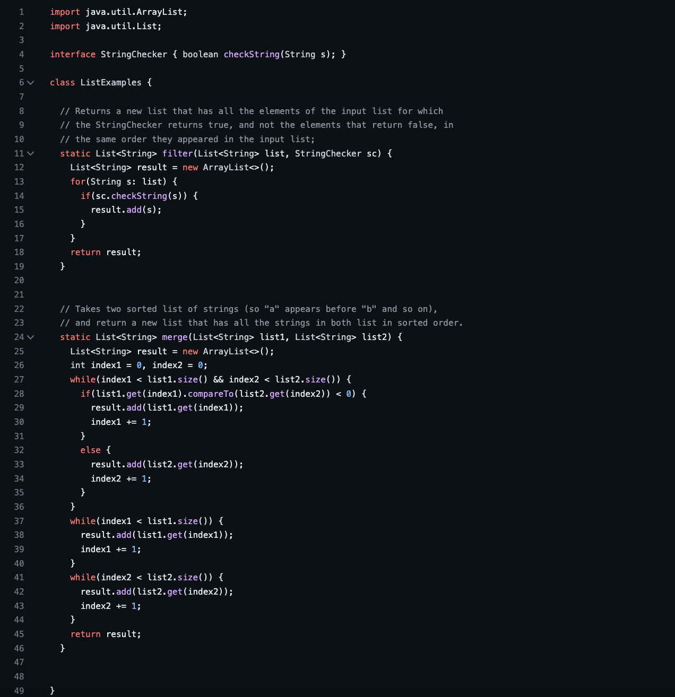
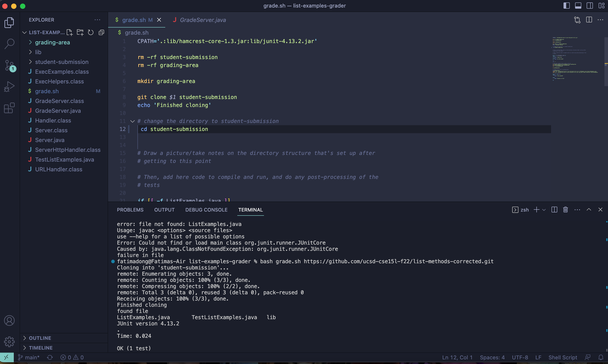

# Lab Report 5

## Part 1 - Debugging Scenario 

### Original Post from a Student

Title: I am stuck on script for grade.sh from week 6

* I am currently using VSCode on my laptop.
* I keep getting an error when I attempt to run the script with the provided student-submission repos from the lab writeup.
* It seems like both my directory and the student submission does not exist. I was unable to use JUnit as well due to the `ClassNotFoundException`.

### TA Response

Did you check which directory you are currently in? Try creating a file diagram or structure to see where the student-submission should be in.

### Student Terminal Screenshot

> This is what my terminal outputted. I am confused why my file does not exist despite that the side shows `Listexamples.java` is already in the `student-submission` directory. 
In addition to that, it also says that these following files or directories do not exist: `TestListExamples.java`, `grading-area`, `student-submission/List-Examples.java`, and `ListExamples.java`. 
The class path is unable to access the JUnit class, which outputs `ClassNotFoundException`. The bug and its symptoms are mainly being unable to access files or directories the way I intended to.
 
### Information Needed for Set Up 
 * 
 
 * 
 
 > This is what the script file looked like before fixing the bug.
 
 * 
 
 > This is what the sample student submission file looked like and whose output was displayed in the terminal.

* The full command line used for the terminal was `bash grade.sh https://github.com/ucsd-cse15l-f22/list-methods-corrected.git`

* Description on how to approach the bug

> Thanks for helping me! I figured out how to make it run now. I needed to change the directory to `student-submission` 
before checking if the file exists. The file is cloned into the `student-submission`. At this point, I was currently in the parent directory, so my script was unable to
determine if my file exists in its child directories. Since I did not change my directory, I was unable to access the student submission files in order to copy and move it to the `grading-area`
directory, which was made in the beginning.

 > Instead of accessing the proper directory, my script eventually went to the parent directory of the entire folder, `list-examples-grader`. As a result, it was unable to 
 check if the files existed at all in its current directory. Hence, I received a `ClassNotFoundException` in my terminal.

## Part 2 - Reflection

I never really thought about using any of these commands for my computer until getting into CSE15L. Something that I thought was pretty cool that we learned in the later half of class was `vim` and 
using script or shells. I never knew that there was a way to edit code files only from the command line! I will use the things that I learned in CSE15L as handy tools in the future.

Thank you for the staff and Professor Politz for everything!
 
